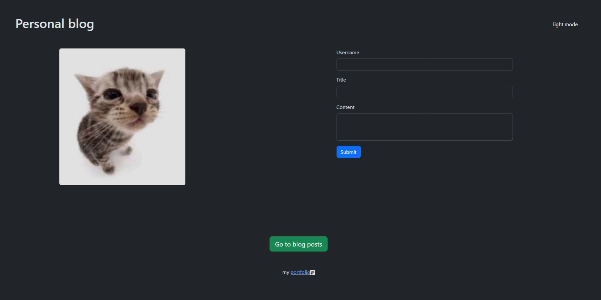

# Personal Blog

This is the repository for my Personal Blog website. Features include:

* Ability to submit and view multiple blog posts utilizing localStorage
* Dark mode toggle utilizing localStorage
* A navigation button connecting the form and blog posts

## Screenshot

## Link to Github page

https://nubsu.github.io/personal-blog/